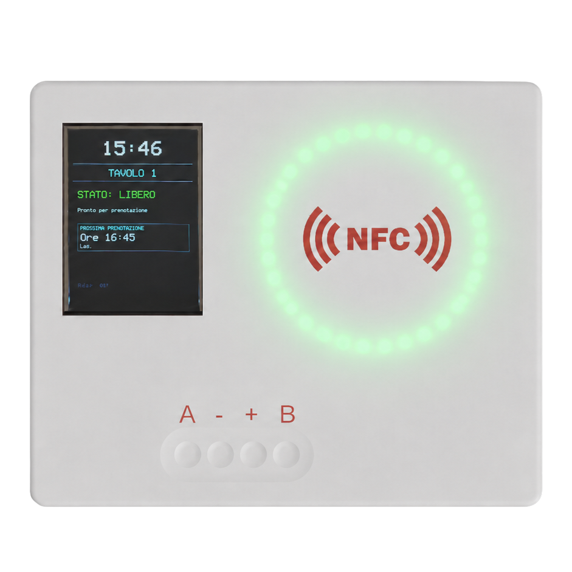
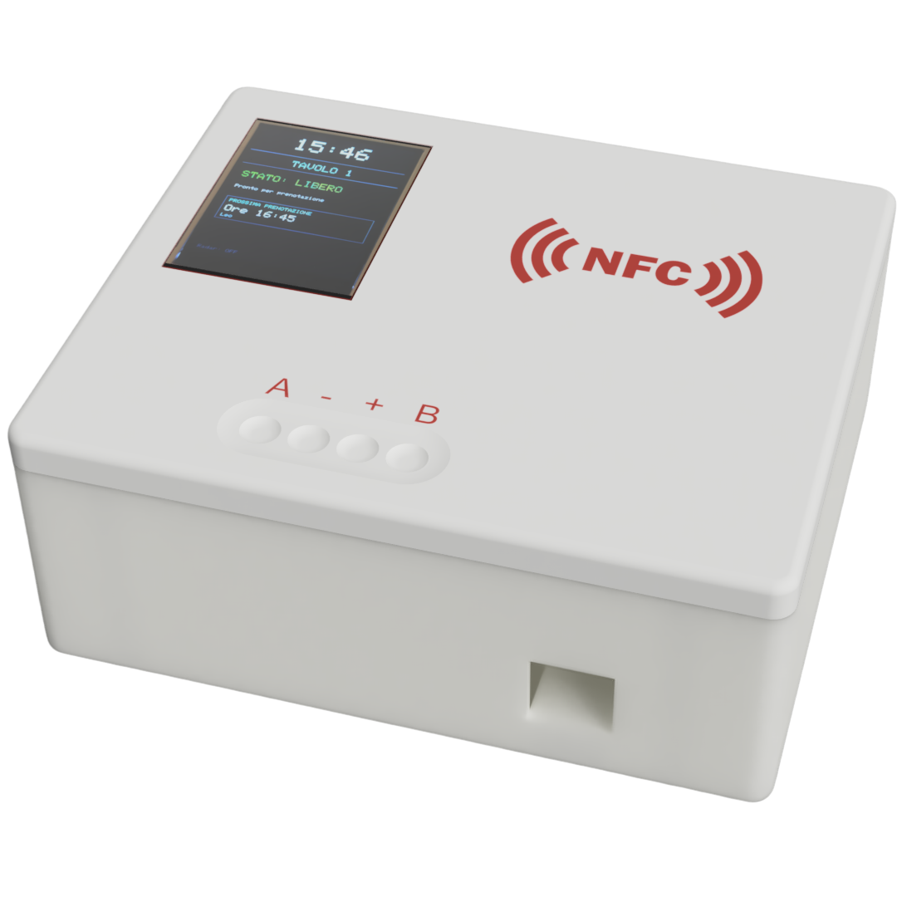
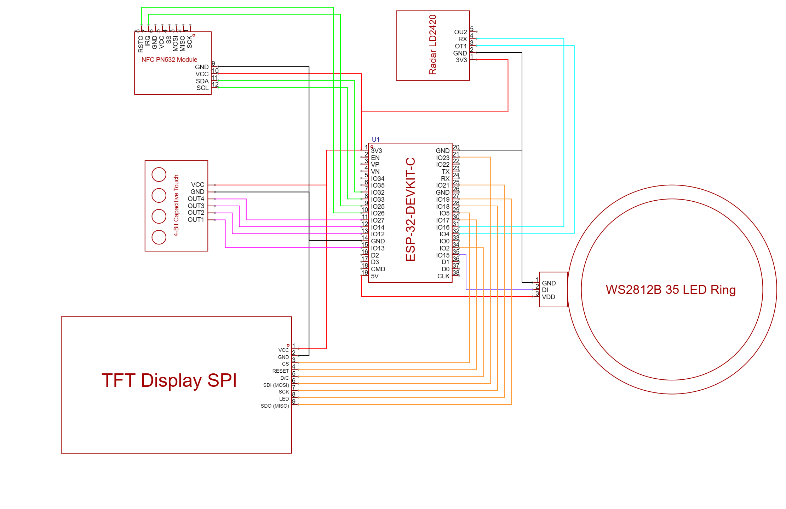
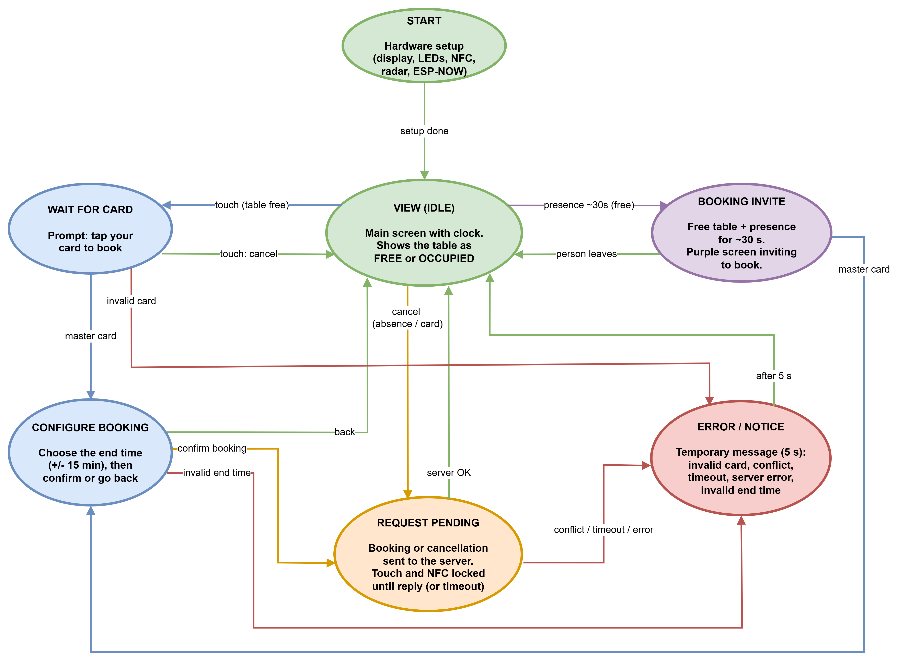
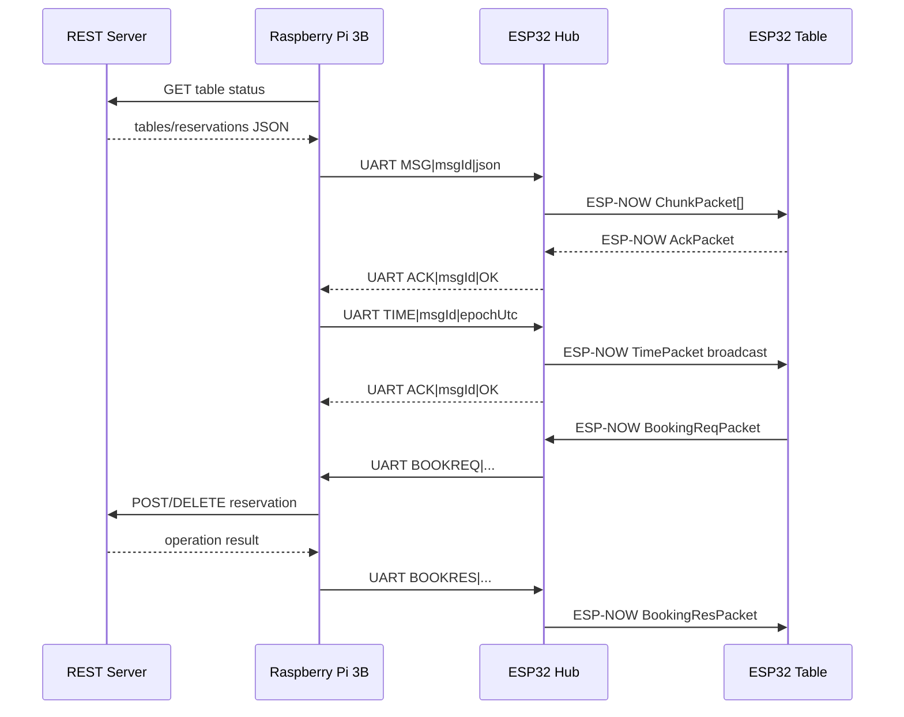

# Smartdesk

Smartdesk is an embedded system for managing a bookable smart table. The project integrates sensors, a local user interface, and wireless communication to display the table status, receive reservations from an external server, and allow users to create or cancel reservations directly from the table.

The system is composed of a table node based on ESP32, a hub node based on ESP32, and a Raspberry Pi 3B that acts as a bridge toward the external REST service.

## Authors

Leonardo Serafin
- Design of the logic of the beheaviour 
- Coding of the communications between devices
- 3D design and printing
- Coding of the 3 boards

Andrea Schwarz
- Radar tuning
- Web interface developement
- Testing and troubleshooting of the sensors 
- Coding of the 3 boards 

## Goals

- Display in real time whether the table is free or occupied.
- Show the next reservation when the table is free.
- Allow local booking through an authorized NFC card.
- Synchronize reservations with an external REST service.
- Automate selected actions based on presence detection from the radar sensor.
- Manage communication between Raspberry Pi, ESP32 hub, and ESP32 table node.

## Phisical Design

<div style="display: flex; justify-content: center; gap: 10%">
 
</div>

## Architecture

The project is divided into three main components.

| Component | Folder | Role |
| --- | --- | --- |
| ESP32 table node | `table-esp/` | Manages display, NFC, radar, touch input, LEDs, and local table logic. |
| ESP32 hub | `hub-esp/` | Receives data from the Raspberry Pi through UART and forwards it to the tables through ESP-NOW. |
| Raspberry Pi | `raspberry/` | Polls the REST server, sends reservation snapshots to the hub, and handles booking/cancellation requests. |

General flow:

1. The Raspberry Pi periodically polls the REST server.
2. If the data of a table changes, the Raspberry Pi sends a UART frame to the ESP32 hub.
3. The hub splits the JSON payload into chunks and sends it to the table through ESP-NOW.
4. The table reconstructs the JSON, updates its reservations, and redraws the user interface.
5. If a booking is requested from the table, the table sends a request to the hub through ESP-NOW.
6. The hub forwards the request to the Raspberry Pi through UART.
7. The Raspberry Pi performs the request to the REST server and sends the response back to the table through the hub.

## Hardware

- 2x ESP32
- 1x Raspberry Pi 3B
- 1x TFT LCD display 320x240
- 1x PN532 NFC module
- 1x WS282B LED ring
- 1x 4-key capacitive touch sensor
- 1x LD2420 radar sensor

## Electrical Schematic



## Software And Libraries

Main development environment: Arduino IDE.

Main libraries:

- ESP-NOW
- `TFT_eSPI`
- `Adafruit_PN532`
- `Adafruit_NeoPixel`
- `ArduinoJson`

Raspberry Pi script:

- Python 3
- `requests`
- `pyserial`

## Repository Structure

```text
.
├── hub-esp/
│   ├── hub-esp.ino
│   ├── Config.h
│   ├── Networking.*
│   ├── UartHandler.*
│   └── Protocol.h
├── table-esp/
│   ├── table-esp.ino
│   ├── Config.h
│   ├── TableFunctions.*
│   ├── TableGlobals.*
│   └── Protocol.h
├── raspberry/
│   └── raspberry-to-esp.py
├── docs/
│   ├── diagramma-stati.png
│   └── schema-scambio-messaggi.md
└── README.md
```

## State Diagram



## Main Table States

| State | Description |
| --- | --- |
| `VIEW` | Main display state. Shows whether the table is free, occupied, or displaying current information. |
| `WAIT FOR CARD` | Waits for an NFC card to start a local booking. |
| `CONFIGURE BOOKING` | Allows the user to select the end time and confirm the booking. |

The table can be free or occupied depending on active reservations and presence detected by the radar sensor. When the table is occupied, future reservations are not shown on the main screen and the NFC reader does not produce user-facing effects.

## Table User Interface

The TFT display shows:

- current time synchronized by the Raspberry Pi;
- table identifier;
- free or occupied status;
- user of the active reservation;
- remaining time of the active reservation;
- next reservation when the table is free;
- booking, error, and confirmation screens.

The LED ring provides a visual indication of the table status. The 4-key capacitive touch sensor is used to start, configure, or confirm a local booking.

## NFC

The PN532 module is used to read NFC cards. Reading is handled through the `IRQ` line, avoiding continuous polling on the I2C bus.

Main table-node connections:

| Signal | ESP32 GPIO |
| --- | --- |
| `SDA_NFC` | 32 |
| `SCL_NFC` | 33 |
| `PN532_IRQ` | 25 |
| `PN532_RESET` | 26 |

A card is considered valid if its UID matches the logic configured in the firmware. In the current code, the UID suffix is checked through `MASTER_UID_SUFFIX`.

## Radar And Automations

The LD2420 radar sensor detects presence at the table. Presence is confirmed after a configurable delay, preventing short passages from being interpreted as stable occupation.

Main automations:

- booking invitation when a person sits at a free table;
- automatic check-in for bookings created from the table;
- absence handling for active reservations;
- automatic cancellation under selected absence conditions.

## Communication

Communication uses two layers:

- UART between Raspberry Pi and ESP32 hub;
- ESP-NOW between ESP32 hub and ESP32 table node.

Simplified message exchange diagram:



The dedicated message exchange file is available at `docs/schema-scambio-messaggi.md`.

## Protocol

The ESP-NOW binary packets are defined in `Protocol.h`, present in both `table-esp/` and `hub-esp/`.

| Packet | Direction | Purpose |
| --- | --- | --- |
| `ChunkPacket` | Hub -> Table | Sends the reservations JSON in multiple fragments. |
| `AckPacket` | Table -> Hub | Confirms message reception and reconstruction. |
| `TimePacket` | Hub -> Table | Synchronizes the clock. |
| `BookingReqPacket` | Table -> Hub | Requests booking creation or cancellation. |
| `BookingResPacket` | Hub -> Table | Sends the response to a booking request. |

## Configuration

Main table-side parameters in `table-esp/Config.h`:

- `TABLE_ID`: table identifier;
- `ESPNOW_CHANNEL`: ESP-NOW radio channel;
- NFC, display, LED, touch, and radar pins;
- automation timeouts and durations.

Main hub-side parameters in `hub-esp/Config.h`:

- UART pins toward the Raspberry Pi;
- ESP-NOW channel;
- table ACK timeout;
- ESP-NOW peer list configured in the firmware.

Main Raspberry-side parameters in `raspberry/raspberry-to-esp.py`:

- serial port `/dev/serial0`;
- baud rate `115200`;
- polling and synchronization intervals;
- external REST server endpoint.

## Upload And Startup

1. Open `table-esp/table-esp.ino` with Arduino IDE and upload it to the table ESP32.
2. Open `hub-esp/hub-esp.ino` with Arduino IDE and upload it to the hub ESP32.
3. Connect the Raspberry Pi and the ESP32 hub through UART.
4. Start the script manually on the Raspberry Pi:

```bash
python3 raspberry/raspberry-to-esp.py
```

## Notes About The REST Server

The Raspberry Pi communicates with an external REST server hosted on fly.dev responsible of holding the json of all the reservations, provides the APIs for the reservations and cancelations.

More infos about the server can be found at: https://github.com/Schwarzoo/smartdesk/

## Project Links
- <href="https://github.com/Schwarzoo/smartdesk">Demo Video</href>
- <href="https://canva.link/smartdesk">Project Presentation</href>