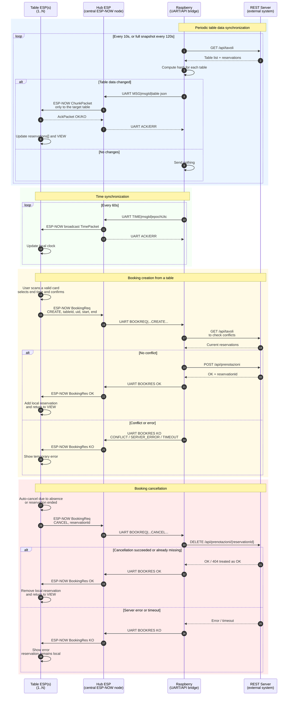

# Message exchange diagram

```mermaid
sequenceDiagram
    autonumber

    participant T as Table ESP(s)<br/>(1..N)
    participant H as Hub ESP<br/>(central ESP-NOW node)
    participant R as Raspberry<br/>(UART/API bridge)
    participant API as REST Server<br/>(external system)

    rect rgb(235, 245, 255)
        Note over R,API: Periodic table data synchronization
        loop Every 10s, or full snapshot every 120s
            R->>API: GET /api/tavoli
            API-->>R: Table list + reservations
            R->>R: Compute hash for each table
            alt Table data changed
                R->>H: UART MSG|msgId|table json
                H->>T: ESP-NOW ChunkPacket<br/>only to the target table
                T-->>H: AckPacket OK/KO
                H-->>R: UART ACK/ERR
                T->>T: Update reservations[] and VIEW
            else No changes
                R->>R: Send nothing
            end
        end
    end

    rect rgb(245, 255, 245)
        Note over R,T: Time synchronization
        loop Every 60s
            R->>H: UART TIME|msgId|epochUtc
            H->>T: ESP-NOW broadcast TimePacket
            H-->>R: UART ACK/ERR
            T->>T: Update local clock
        end
    end

    rect rgb(255, 250, 230)
        Note over T,API: Booking creation from a table
        T->>T: User scans a valid card<br/>selects end time and confirms
        T->>H: ESP-NOW BookingReq<br/>CREATE, tableId, uid, start, end
        H->>R: UART BOOKREQ|...CREATE...
        R->>API: GET /api/tavoli<br/>to check conflicts
        API-->>R: Current reservations

        alt No conflict
            R->>API: POST /api/prenotazioni
            API-->>R: OK + reservationId
            R->>H: UART BOOKRES OK
            H->>T: ESP-NOW BookingRes OK
            T->>T: Add local reservation<br/>and return to VIEW
        else Conflict or error
            R->>H: UART BOOKRES KO<br/>CONFLICT / SERVER_ERROR / TIMEOUT
            H->>T: ESP-NOW BookingRes KO
            T->>T: Show temporary error
        end
    end

    rect rgb(255, 235, 235)
        Note over T,API: Booking cancellation
        T->>T: Auto-cancel due to absence<br/>or reservation ended
        T->>H: ESP-NOW BookingReq<br/>CANCEL, reservationId
        H->>R: UART BOOKREQ|...CANCEL...
        R->>API: DELETE /api/prenotazioni/{reservationId}

        alt Cancellation succeeded or already missing
            API-->>R: OK / 404 treated as OK
            R->>H: UART BOOKRES OK
            H->>T: ESP-NOW BookingRes OK
            T->>T: Remove local reservation<br/>and return to VIEW
        else Server error or timeout
            API-->>R: Error / timeout
            R->>H: UART BOOKRES KO
            H->>T: ESP-NOW BookingRes KO
            T->>T: Show error<br/>reservation remains local
        end
    end
```
